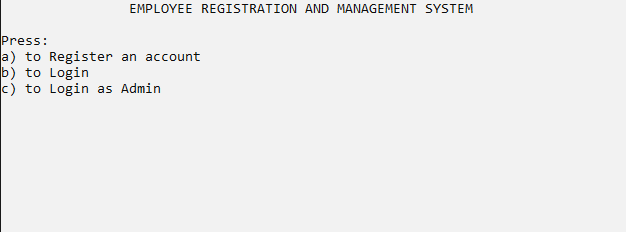
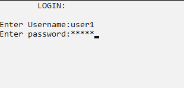

# empRegAndMgt
This was my first major C project. It's kind of a stupid project. You can "register" a user and log in using the username and password that you used to register. I simply just stored the username and password in a file (`.txt` and `.dat` files in the repo) . Also, I didn't bother to structure the codebase, apologies for that. 

Also, this project may only work with windows because of `system("cls")`, and I didn't bother to change this one either.

## Other features
- a "notice board" for admins to post notice
- add, delete, and modify records (by the admin)
- a message board for users

## Build
- build with C90 or lower
```
clang main.c -o main.exe -std=c90
clang admin.c -o admin.exe -std=c90
```
- build `admin.c` file to change the admin password.

## Screenshots


